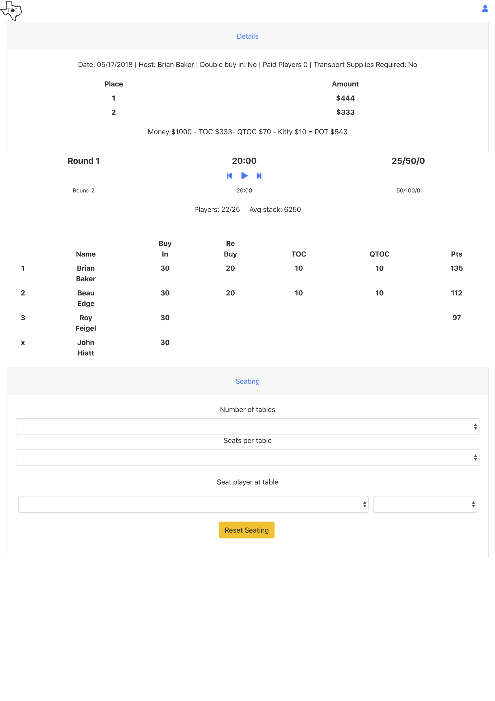

# poker-league-current-game (react/redux) 

I am rewriting my poker league application from core Spring 3.x and JQuery mobile to Spring Boot and React/Redux.

This is the beginning of writing a new front end using React and Redux.

I've begun with the heart of the poker league application - the game in progress.

The following shows what I did step by step.

Each step can be found on the cooresponding branch.

## step 04 current game players
Started fleshing out the react Players component for the current game.

## step 03 details component
Started fleshing out the react Details component for the current game.

Had to code the component as a class
```
class Details extends React.Component {
```
instead of a functional component
``` 
const Details = () => (
```
I will have to ask my react savvy coworkers how to move from
a class to a function.

Drove data to the Details component from the App component to see it render.

Temporarily using some inline styles. Will move to css file(s) near the end of the project.

The date of the game is in milliseconds at UTC-0. Installed moment timezone
* npm install moment-timezone --save 

to convert the date to text in central time.

## step 02 screen layout
**Note:** Leaving out the git commands from this step on.

The current game is the heart of the poker league application. 
It is fashioned after what you would see if playing in a tournment in a casino.

A simplified mock up 



There is so much more to a game than what is depicted in the mockup but
it is a good place to start (and then iterate on).

#### Presentation (react) components
* Details
* Clock
* Players
* Seating

Created the skelton for the react components for the four bulleted items above.
Changed the main App to include the new react components.

## step 01 create development environment
To get started did the following.

From https://reactjs.org/docs/create-a-new-react-app.html#create-react-app

* _npx create-react-app poker-league-current-game_
* _cd poker-league-current-game_

Removed the .git directory
* _rm -rf .git_

Created github repository poker-league-current-game
Hooked up react-redux-tutorial with the github repository

* _git init_
* _git add ._
* _git commit -m "initial commit"_
* _git remote add origin https://github.com/gpratte/poker-league-current-game.git_
* _git push origin poker-league-current-game_

Make sure the initial react application works. Run
* _npm start_

should see the default react page in the web browser at http://localhost:3000/

From the redux tutorial "Usage with React" https://redux.js.org/basics/usage-with-react install react-redux
* _npm install --save react-redux_

Push changes
* _git add ._
* _git commit -m "added react-redux npm package"_
* _git push origin poker-league-current-game_

Push to master
* _git checkout master_
* _git merge step-01-create-development-environment_
* _git push origin master_
